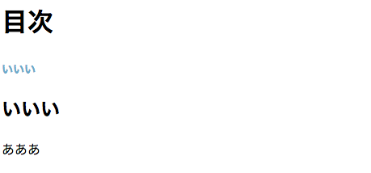

# mokuji

自動で目次を生成する JavaScript

## Usage

```html
<body onload="mokuji(2,4)">
  <h1>目次</h1>
  <div id="mokuji"></div>
  <h2>いいい</h2>
  <p>あああ</p>
  <script src="mokuji.js"></script>
</body>
```



## サンプル
- [mokuji のサンプル](https://tanjo.github.io/mokuji/)
